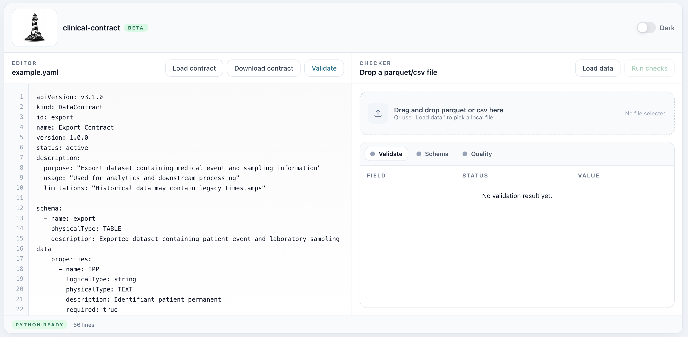

# clinical-contract

`clinical-contract` helps you make sure your dataset really matches what you documented.

Live demo: [clinical-contract](https://artheioupfat.github.io/clinical-contract/)

You define expectations in a YAML contract, then run checks on real `.parquet` or `.csv` files.



## What is this project for?

The goal is simple:
- keep data expectations clear,
- validate contracts before using them,
- catch schema and quality issues early.

It is useful for data teams, analytics workflows, and CI checks.

## Two ways to use it

1. As a Python library / CLI (`clinical-contract`) for local and CI validation.
2. As a static web app (PyScript + DuckDB) to test contracts directly in the browser.

## Quick start

### Install the package

```bash
pip install clinical-contract
```

### Validate a contract file

```bash
clinical-contract validate path/to/contract.yaml
```

### Run checks on data

```bash
clinical-contract check path/to/contract.yaml path/to/data.parquet
# or
clinical-contract check path/to/contract.yaml path/to/data.csv
```

## Contribute locally (with `uv`)

```bash
git clone https://github.com/artheioupfat/clinical-contract.git
cd clinical-contract
uv sync --extra dev
uv run pytest -v
pytest --cov=src/clinical_contract --cov-report=term-missing
```


## Notes

Detailed contract format and advanced rules are intentionally documented on the website docs page.
This README stays short and easy to onboard with.


## License

MIT — see [LICENSE](LICENSE) for details.

---

## Author

**Arthur PRIGENT** — [GitHub](https://github.com/artheioupfat)
