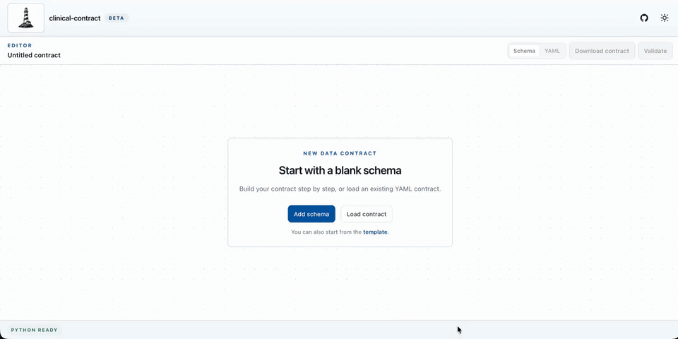

# clinical-contract

> Write healthcare data contracts, validate their structure, and check CSV or Parquet datasets against them.

[](https://pypi.org/project/clinical-contract/)
[](https://pypi.org/project/clinical-contract/)
[](LICENSE)

`clinical-contract` is a lightweight tool for teams that need to describe, share, and verify clinical data expectations.

It helps you:

- write a data contract with a guided web editor or YAML;
- validate that the contract is correctly composed;
- check that a real `.parquet` or `.csv` file conforms to the expected schema;
- run SQL quality rules with DuckDB;
- use the same logic in the browser, the CLI, and Python pipelines.

<p align="center">
  
</p>


## Live Web App

The project includes a static browser application designed for GitHub Pages:

[Open the web editor](https://artheioupfat.github.io/clinical-contract/)

The web app lets users create or load a contract, edit it visually, inspect the generated YAML, validate the contract, upload a CSV/Parquet file, preview the dataset, and run schema/quality checks directly in the browser with PyScript, Pyodide, and DuckDB.

## Why It Exists

Clinical data exchanges often fail because the expected dataset is documented in one place while the real delivered file follows another reality.

`clinical-contract` keeps the expectation and the verification close together:

- the contract explains what the dataset should contain;
- the checker verifies what the dataset actually contains;
- the quality rules make important assumptions executable.

This makes data delivery easier to review, easier to automate, and easier to discuss between data producers and data consumers.

## What It Checks

`clinical-contract` currently focuses on three practical layers:

1. **Contract structure**
   Required metadata, description fields, schema definitions, columns, and quality rules are validated before checking data.

2. **Schema compatibility**
   Required columns must exist and detected DuckDB types must match the contract logical or physical types.

3. **Quality rules**
   SQL checks are executed against the loaded CSV/Parquet file and reported as passed or failed.

## Python Package

The same engine is available as a Python package on PyPI.

```bash
pip install clinical-contract
```

Validate a contract:

```bash
clinical-contract validate examples/example_contract.yaml
```

Check a data file:

```bash
clinical-contract check examples/example_contract.yaml data.parquet
```

Use it from Python:

```python
from clinical_contract import load_contract

contract, raw = load_contract("examples/example_contract.yaml")
report = contract.check("data.parquet")

print(report.success)
```

## Local Development

Clone the repository:

```bash
git clone https://github.com/artheioupfat/clinical-contract.git
cd clinical-contract
```

Install Python dependencies:

```bash
uv sync --extra dev
```

Run Python tests:

```bash
uv run pytest -v
```

Install web dependencies:

```bash
npm ci
```

Run site tests:

```bash
npm run test:site
```

Build the site CSS:

```bash
npm run build:site:css
```

Serve the static site locally:

```bash
python3 -m http.server 8000 --directory site
```

Then open `http://127.0.0.1:8000`.

## Project Structure

```text
src/clinical_contract/   Python package and validation engine
site/                    Static web app for GitHub Pages
examples/                Example contracts
tests/                   Python test suite
site/tests/              JavaScript site tests
```

## Status

The project is still evolving. The current focus is to keep the Python library, CLI, and browser app aligned around one DuckDB-based validation engine.

## License

MIT — see LICENSE for details.

## Author

Arthur PRIGENT — GitHub
